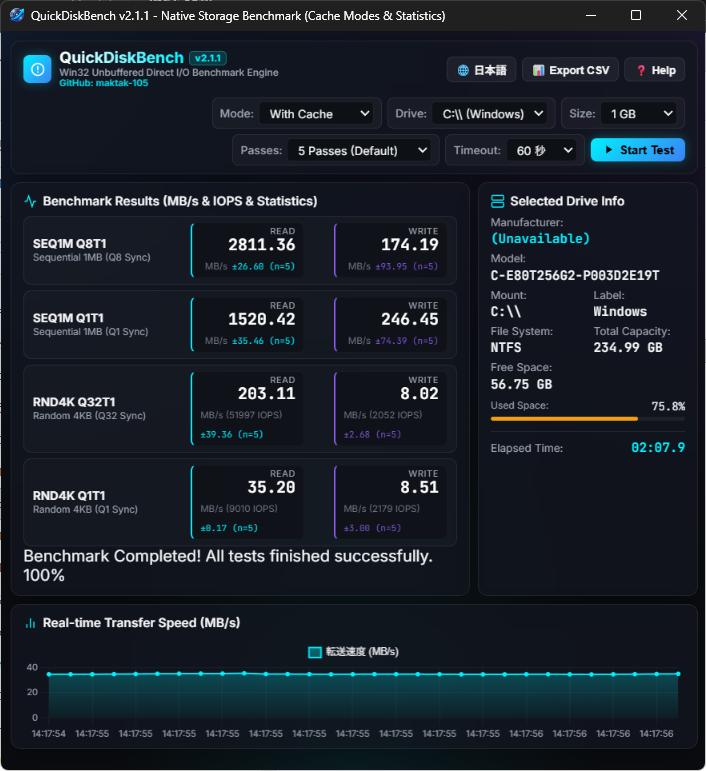

# QuickDiskBench

<p align="center">
  
</p>

QuickDiskBench is a Windows SSD / HDD / NVMe benchmark tool. It measures sequential and random transfer performance and IOPS using Direct I/O with the Windows OS cache bypassed.

## Using the binary release

If you do not need the source code or Python environment, download the distribution ZIP from GitHub Releases.

- [Latest releases](https://github.com/maktak-105/QuickDiskBench/releases)
- [QuickDiskBench v3.0.0](https://github.com/maktak-105/QuickDiskBench/releases/tag/v3.0.0)
- [Direct download of QuickDiskBench-binary.zip](https://github.com/maktak-105/QuickDiskBench/releases/download/v3.0.0/QuickDiskBench-binary.zip)

The ZIP contains all distribution files in one flat folder:

- `QuickDiskBench.exe` - GUI version (self-contained embedded HTML)
- `QuickDiskBench_cli.exe` - command-line version
- `WebView2Loader.dll` - WebView2 loader
- `benchmark-all-drives.ps1` - script for benchmarking all fixed volumes
- `readme.txt` / `readme_jp.txt` - distribution documentation
- `history.txt` / `history_jp.txt` - update history
- `LICENSE.txt` / `LICENSE_jp.txt` - MIT License files

### Integrity verification (SHA-256)

Official SHA-256 checksums for the distribution ZIP and binaries are automatically computed during the CI (GitHub Actions) build and published as `SHA256SUMS.txt` on each release page. Verify the downloaded package with PowerShell:

```powershell
Get-FileHash .\QuickDiskBench-binary.zip -Algorithm SHA256
```

Run `QuickDiskBench.exe` for the GUI. The language switch, CSV export, and Help buttons are stacked on the right side of the header in both Japanese and English. The author badge is shown in a separate Version Info dialog, opened from a button at the top of the Help dialog. If WebView2 Runtime is unavailable, install Microsoft Edge WebView2 Runtime (Evergreen). It is normally included with Windows 11, but may require installation on older Windows 10 systems, LTSC, Server, or managed devices.

## CLI usage

```powershell
cd I:\path\to\QuickDiskBench-binary
.\QuickDiskBench_cli.exe --help
.\QuickDiskBench_cli.exe --drive D:\ --size 512 --passes 3
.\QuickDiskBench_cli.exe --drive D:\ --raw --csv result.csv
.\QuickDiskBench_cli.exe --drive D:\ --size 4096 --timeout 120
```

Main options:

- `--drive PATH` - target location, for example `C:\`
- `--size MiB` - temporary test-file size; minimum 64 MiB, default 256 MiB
- `--passes N` - number of repetitions for each test (1-9)
- `--timeout SEC` - per-test timeout; default 60 seconds, range 1-3600
- `--raw` - add Write-Through to reduce the effect of device-side write caching
- `--csv PATH` - save the result summary as CSV

The default timeout is 60 seconds per test. For 4 GiB or larger tests, or when a slow or busy drive reports Win32 error 1460 (timeout), retry with a larger value such as `--timeout 120` or `--timeout 180`.

The GUI provides the same timeout choices in its `Timeout` control: 60, 120, 180, 300, or 600 seconds. When no I/O completes, it displays `Waiting for I/O`; progress is based on completed I/O operations rather than elapsed time, and the chart shows the waiting period as 0 MB/s. After the run, the drive information panel shows the total elapsed measurement time.

## Benchmark all drives

Open PowerShell in the distribution folder and run:

```powershell
cd I:\path\to\QuickDiskBench-binary
.\benchmark-all-drives.ps1
```

Specify size, pass count, and timeout as needed:

```powershell
.\benchmark-all-drives.ps1 -SizeMiB 256 -Passes 2
.\benchmark-all-drives.ps1 -SizeMiB 4096 -TimeoutSec 120
```

If execution policy blocks the script:

```powershell
powershell -ExecutionPolicy Bypass -File .\benchmark-all-drives.ps1
```

The script enumerates fixed volumes and writes a combined summary to `results\summary-YYYYMMDD-HHMMSS.csv`. Close important applications and ensure sufficient free space before running write tests.

## Cache modes

- With cache: `FILE_FLAG_NO_BUFFERING` bypasses the Windows OS cache while allowing device hardware cache.
- Without cache: `FILE_FLAG_NO_BUFFERING` is combined with `FILE_FLAG_WRITE_THROUGH` to reduce the effect of device hardware cache.

Results vary with drive temperature, free space, power settings, connection method, background activity, and firmware.

## Building from Source

The binary release is recommended for normal use. If you want to build it yourself, follow the instructions below.

### Native build prerequisites

The native build uses the MinGW-w64 C++ toolchain, validated with WinLibs (MCF threads, UCRT runtime):

```powershell
winget install --id BrechtSanders.WinLibs.MCF.UCRT --exact --source winget
```

`scripts/build.py` automatically searches the standard WinGet package location and also looks for `windres.exe` next to the detected compiler, so adding MinGW to `PATH` is not required for the project build. Add the package's `mingw64\bin` directory to the **user** `PATH` if you also want to invoke `g++` and `windres` directly. With the standard WinGet installation, it is usually:

```text
%LOCALAPPDATA%\Microsoft\WinGet\Packages\BrechtSanders.WinLibs.MCF.UCRT_Microsoft.Winget.Source_8wekyb3d8bbwe\mingw64\bin
```

Building the application:

```powershell
scripts\build.bat
# or python scripts/build.py
```

The WebView2 SDK headers are expected at `C:\tools\webview2\build\native\include` by default. Set `WEBVIEW2_INCLUDE` if the SDK is installed elsewhere.

## About the Prototype

`proto/browser/main.py` is a development and verification FastAPI browser prototype.

```powershell
python -m pip install -r scripts/requirements.txt
python proto/browser/main.py
```

It is a FastAPI server that serves the same UI (`src/ui/index.html`) in a browser, and loads `dist/engine_x64.dll` (the same C++ engine as the shipped `QuickDiskBench.exe`) via `ctypes` for disk measurement. It only falls back to a pure-Python I/O implementation when that DLL has not been built. See [`docs/about.md`](docs/about.md) for details.

## License

This project is provided under the MIT License. See [`LICENSE`](LICENSE) (also shipped as [`docs/distribution/LICENSE.txt`](docs/distribution/LICENSE.txt)) for the English original and [`docs/distribution/LICENSE_jp.txt`](docs/distribution/LICENSE_jp.txt) for the Japanese reference translation.

## Disclaimer

This software is provided as-is. The author assumes no responsibility for write tests, measurement results, data loss, system failures, or hardware damage. Always back up important data before use.

## Design Philosophy: Focusing on Practical Stability

While standard benchmarks excel at measuring peak burst performance, real-world workloads—such as loading large local LLM models or intensive data processing—heavily rely on sustained speed and consistency.

QuickDiskBench was developed to quickly diagnose drive performance under practical conditions, born from real troubleshooting with local AI environments.

- **Average & Standard Deviation:** Evaluates practical throughput and stability by calculating the average speed and variance across multiple rapid runs.
- **Direct I/O (Cache-Bypass Mode):** Bypasses OS/controller cache buffering to help observe the drive's baseline performance under continuous load.
- **Time-Efficient Diagnostics:** Quickly provides actionable diagnostic data without prolonged wait times.
