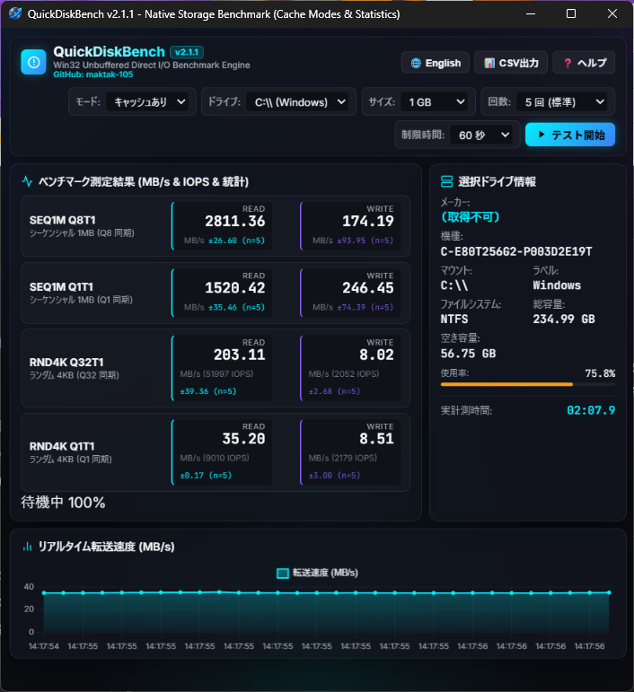

# QuickDiskBench

<p align="center">
  
</p>

Windows向けのSSD / HDD / NVMeベンチマークツールです。WindowsのOSキャッシュを常にバイパスしたDirect I/Oで、シーケンシャルおよびランダムアクセスの速度とIOPSを測定します。

## 配布版を使う

ソースコードやPython環境がない場合は、GitHub Releasesから配布用ZIPをダウンロードしてください。

- [最新版の配布ページ](https://github.com/maktak-105/QuickDiskBench/releases)
- [QuickDiskBench v2.1.1](https://github.com/maktak-105/QuickDiskBench/releases/tag/v2.1.1)
- [QuickDiskBench-binary.zipを直接ダウンロード](https://github.com/maktak-105/QuickDiskBench/releases/download/v2.1.1/QuickDiskBench-binary.zip)

ZIPを展開すると、すべての配布ファイルが同じフォルダに入ります。

- `QuickDiskBench.exe` - GUI版
- `QuickDiskBench_cli.exe` - コマンドライン版
- `WebView2Loader.dll` - WebView2接続用ローダー
- `index.html` - GUI本体
- `benchmark-all-drives.ps1` - 固定ドライブ一括測定スクリプト
- `README.txt` / `README-en.txt` - 使用説明書
- `LICENSE.txt` / `LICENSE-ja.txt` - MIT License

GUI版は `QuickDiskBench.exe` を実行します。WebView2 Runtimeがない場合は、Microsoft Edge WebView2 Runtime (Evergreen)をインストールしてください。Windows 11には通常含まれていますが、Windows 10の古い環境、LTSC、Server、管理端末では追加導入が必要な場合があります。

## CLIの使い方

```powershell
cd I:\path\to\QuickDiskBench-binary
.\QuickDiskBench_cli.exe --help
.\QuickDiskBench_cli.exe --drive D:\ --size 512 --passes 3
.\QuickDiskBench_cli.exe --drive D:\ --raw --csv result.csv
.\QuickDiskBench_cli.exe --drive D:\ --size 4096 --timeout 120
```

主なオプション：

- `--drive PATH` - 測定先（例：`C:\`）
- `--size MiB` - 一時測定ファイルのサイズ。最小64 MiB、既定256 MiB
- `--passes N` - 各テストの反復回数（1～9）
- `--timeout SEC` - 各テストのタイムアウト秒数。既定60秒、1～3600秒
- `--raw` - Write-Throughを追加し、デバイス側書き込みキャッシュの影響を抑制
- `--csv PATH` - 結果サマリーをCSV保存

各テストのタイムアウトは既定60秒です。4GB以上の測定や、低速・高負荷状態のドライブでWin32エラー1460（タイムアウト）が出る場合は、`--timeout 120`や`--timeout 180`のように値を増やして再実行してください。GUI版も既定60秒で動作します。

GUI版では上部の「制限時間」から60 / 120 / 180 / 300 / 600秒を選択できます。測定中にI/O完了がない場合は「I/O待機中」と表示され、進捗率は経過時間ではなく完了したI/O数に基づいて更新されます。グラフにも待機中の0 MB/sが反映されるため、ストレージが応答待ちになった状態を確認できます。測定完了後は、ドライブ情報パネルの下部に全テストの実計測時間が表示されます。

## 全ドライブを測定する

PowerShellで配布フォルダへ移動し、カレントフォルダを示す` .\`を付けて実行します。

```powershell
cd I:\path\to\QuickDiskBench-binary
.\benchmark-all-drives.ps1
```

サイズと回数を指定する例：

```powershell
.\benchmark-all-drives.ps1 -SizeMiB 256 -Passes 2
# 4GB測定などで時間を延長する場合
.\benchmark-all-drives.ps1 -SizeMiB 4096 -TimeoutSec 120
```

実行ポリシーで拒否される場合：

```powershell
powershell -ExecutionPolicy Bypass -File .\benchmark-all-drives.ps1
```

スクリプトは固定ボリュームを列挙し、各ドライブをCLIで測定します。全ドライブの結果は`results\summary-YYYYMMDD-HHMMSS.csv`という1つのCSVにまとめられます。書き込みテストを行うため、重要な処理を終了し、対象ドライブの空き容量を確保してから実行してください。

## 測定モード

- キャッシュあり：`FILE_FLAG_NO_BUFFERING`でWindows OSキャッシュを使わず、ストレージ側のハードウェアキャッシュは使用可能
- キャッシュなし：OSキャッシュを使わないまま`FILE_FLAG_WRITE_THROUGH`を追加し、ハードウェアキャッシュの影響も抑制

測定値は、ドライブの温度、空き容量、電源設定、接続方式、バックグラウンド処理、ファームウェアなどで変動します。

## ソースから起動する場合

```powershell
python -m pip install -r requirements.txt
python main.py
```

ただし、通常の利用にはGitHub Releasesの配布ZIPを推奨します。ネイティブ版のビルドにはWindows用LLVM-MinGWとWebView2 SDKが必要です。

## ライセンス

MIT Licenseです。英語原文は[`dist/documents/LICENSE.txt`](dist/documents/LICENSE.txt)、日本語参考訳は[`dist/documents/LICENSE-ja.txt`](dist/documents/LICENSE-ja.txt)を確認してください。

## 注意事項

本ソフトウェアは現状有姿で提供されます。書き込みテスト、測定結果、データ消失、システム障害、ハードウェア故障などについて作者は責任を負いません。重要なデータは必ずバックアップしてから使用してください。

## 設計思想：実用的な安定性と再現性の重視

一般的なベンチマークはピーク時の最大性能を測るのに適していますが、ローカルLLMの大規模モデルのロードや連続データ処理など、実際の現場では**「持続的な実効速度」と「動作の安定性（速度ムラの少なさ）」**が重要になります。

QuickDiskBench は、ローカルAI環境のセットアップ時に遭遇したドライブ起因の課題をきっかけに、実務に即したドライブの状態を手軽に診断できるツールを目指して開発されました。

- **平均値と標準偏差（ばらつき）の算出:** 複数回の高速テストから平均値と標準偏差を計算し、速度の安定性・ムラを客観的に把握できます。
- **Direct I/O（キャッシュ無効化モード）:** キャッシュの影響を抑えることで、連続した負荷がかかった際のドライブ本来の挙動を確認できます。
- **短時間での測定:** 待ち時間を大幅に抑え、必要な診断結果を素早く確認できます。
